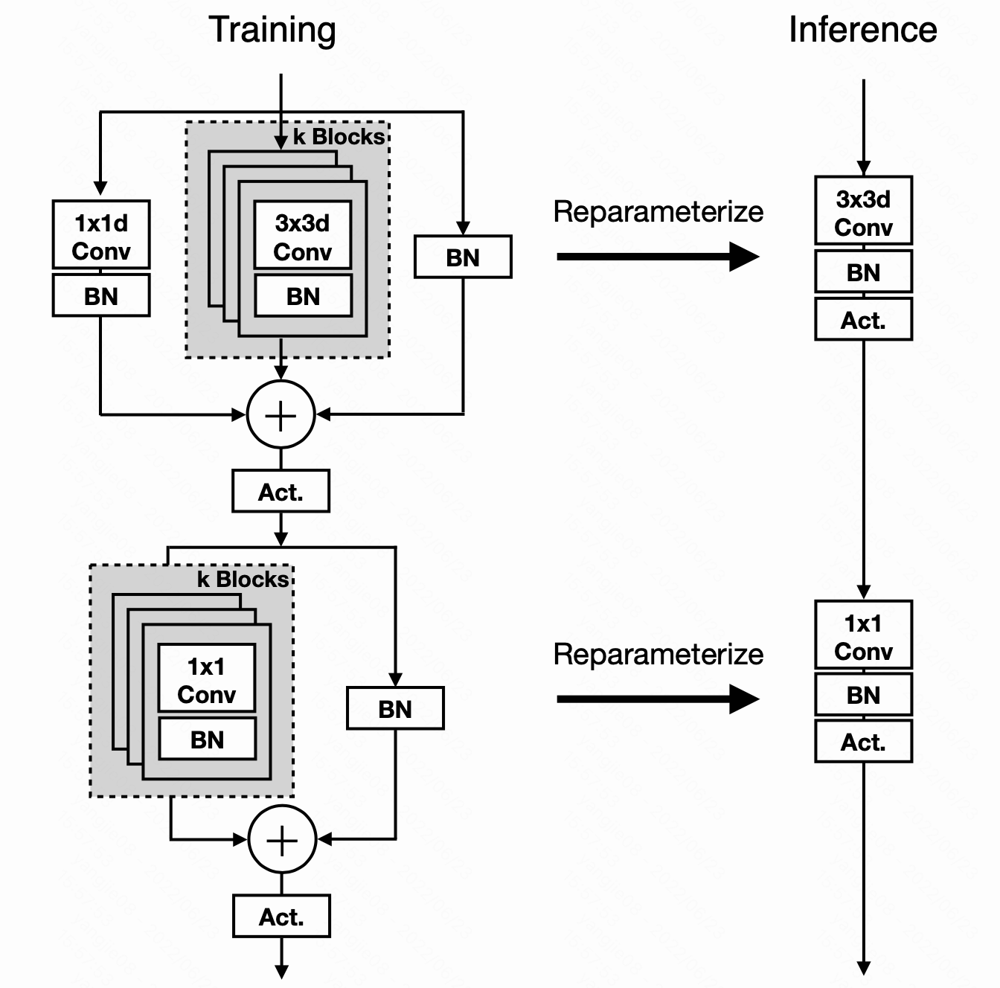

# MobileOne: An Improved One millisecond Mobile Backbone
This is an un-official implementation of Paper [An Improved One millisecond Mobile Backbone](https://arxiv.org/abs/2206.04040), whose performance is close to the paper.

Actually I achieve the MobileOne' s0 architecture (the smallest one), and validate on ImageNet-1000k dataset. And a val accuracy is here.

|Model | before merging blocks | after merging blocks | FLOPS |
| --- | --- | --- | --- | 
|origin paper (s0)| none  | 71.4 | 275M |
|my implementation (s0) |  x | x | 274M |

Note that I only train a "s0" version, but you can easily modify the code to train other version, please see "mobileone.py" to refer to a configuration.

Different from original paper, We don't use: 
- [ ] AutoAugment. In fact, S0 indeed abandons autoaugment. 
- [ ] annealed weight decay. I set it constantly 4e-5.
- [ ] label smoothing regularization
- [ ] EMA update strategy
- [ ] progressive learning curriculum. I directly use 224px to train.
- [ ] Custom Weight decay Loss. I directly use WeightDecay in optimizer.

## For validation
I release a pretrained model weight, click [here]() to download.
The test script validates the trained model, and also generates a converted deploy model.
> python test.py {your imagenet-1000k dataset path} deploy mobileone_s0_hello_best.pth.tar

A converted deploy model is generated at "mobileone_deploy_model.pt" file.

## For train
I train the mobileone-s0 on 8 32G-V100 GPUS, costing about 4 days.
> python train.py -a mobileone_s0 --dist-url 'tcp://127.0.0.1:23333' --dist-backend 'nccl' --multiprocessing-distributed --world-size 1  --rank 0 --workers 32 {your imagenet-1000k dataset path} --tag hello  --wd 4e-5

## For use
> model = make_mobileone_s0(deploy=True)
> model.load(torch.load('mobileone_depoly_model.pt'))
> model.cuda()

## acknowledgement
The entire code is based on [RepVGG](https://github.com/DingXiaoH/RepVGG) repository. Thanks for simply-using code.
